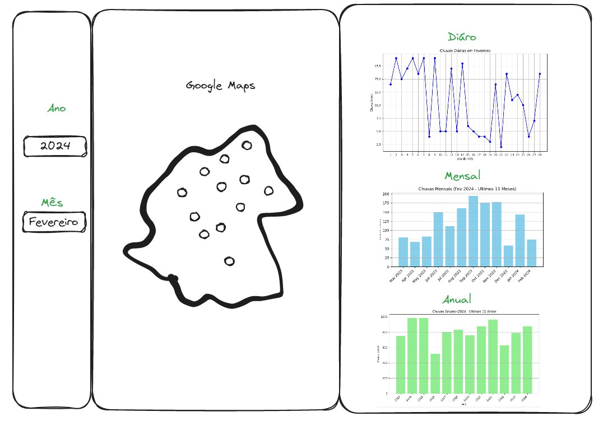

## Aplicação Web para Exibir Informações de Chuvas Coletadas em Postos Pluviométricos.

1. Criar uma aplicação usando o Framework Web [Flask](https://flask.palletsprojects.com/en/3.0.x/) (ou qualquer linguagem ou framework web de sua preferência) para exibir dados de chuvas em uma mapa georeferenciado;

2. Para o mapa, pode-se usar a Api do [Google Maps](https://developers.google.com/maps/apis-by-platform?hl=pt-br), [OpenStreetMaps](https://wiki.openstreetmap.org/wiki/API) ou outra API de sua preferência;

3. A aplicação deverá mostrar um mapa com os Postos Pluviométricos (80.csv, 133.csv e 349.csv) georeferenciados e gráficos com as informações de chuva para um determinado posto selecionado;

    3.1 A aplicação deverá ter 2 (dois) seletores para escolher a data: Ano e Mês.

    3.2 Deverá ser possível clicar no Postos Pluviométricos georeferenciadas e ao clicar exibir 3 gráficos:

    3.2.1 Gráfico 1: Série temporal diária de chuva com base na data escolhida no item 3.1;

    3.2.2 Gráfico 2: Série temporal do acumulado mensal de chuva dos últimos 12 meses (mês atual + 11 meses passados) com base na data escolhida no item 3.1;

    3.2.3 Gráfico 3: Série temporal do acumulado anual de chuva dos últimos 10 anos (ano atual + 9 anos passados) com base na data escolhida no item 3.1;

    3.2.4 Recomenda-se o uso da biblioteca Python [Pandas](http://pandas.pydata.org) para filtro de datas e para calcular os acumulados mensal e anual dos itens 3.2.2 e 3.2.3; (Pandas é só para Python!)

5. Usar [Docker](https://www.docker.com/) e [docker-compose.yml](https://docs.docker.com/compose/) para subir a aplicação; (não obrigatório)

6. Criar um repositório [github](https://github.com) público com o código fonte da sua aplicação para avaliação;

7. Abaixo um esboço da aplicação web:

